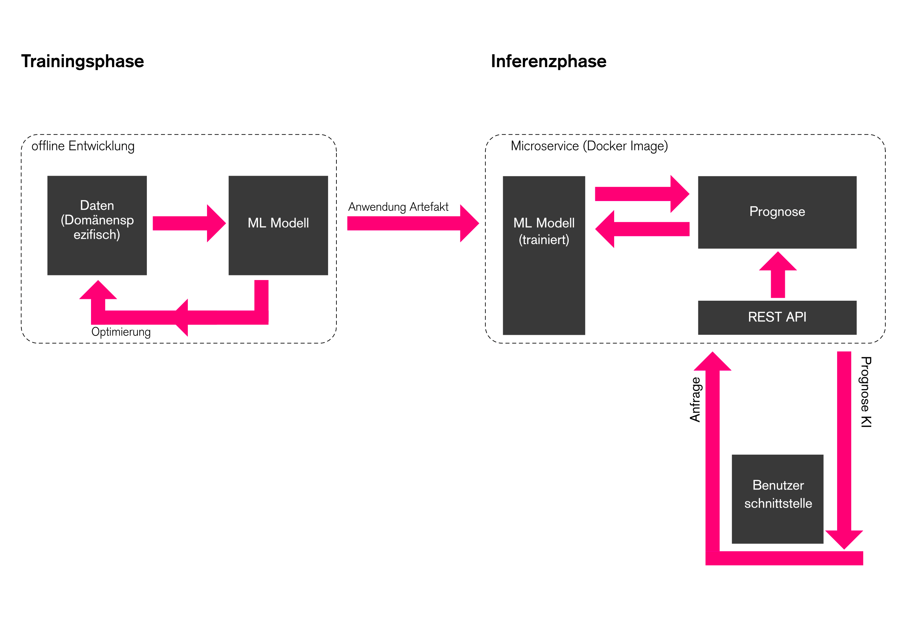

# Automated Classification of Architectural Drawings 

This docker image builts an API which categorizes architectural drawings through
Convolutional Neural Networks.
The goal was to develop a framework to automatically create relevant metadata of drawings
for the purpose of long-term archiving.
The API takes a user input parsed via the HTTP interface in server.py, runs predictions on n number of images
and stores the predictions in either a JSON-string or a csv-file. 

It is an ongoing research from the [FID BAUdigital](https://kickoff.fid-bau.de/en/), conducted at the Universitäts- und Landesbibliothek Darmstadt, at the TU Darmstadt.

**PredictDrawingCategory**

This script predicts if an architectural drawing either belongs to the category of a floor plan, a section or an elevation
through a Multi-Class Classification Model. The accepted drawing types are therefore: floor plan, elevation and section.

To train the network on drawing categories, the following network architecture was used:

**PredictDesignPattern**

This script estimates the presence of certain architectural design patterns in floor plan drawings, built on top of
my DeepPattern repository. Categories/Patterns include the following shapes: _Rectangle, Circle, Composite-rectangular,
Organic, Longitudinal, Polygonal_.
It furthermore includes the following interior Patterns: _Atrium, Column Grid and Staircase_.
Accepted drawing types are thus only floor plans.

**Usage**

To run the API:

1. `git clone`
2. `docker build -t python3 -f build/package/Dockerfile`
3. `docker -p 8080:8080 run python3`
4. `http://localhost:8080/pattern or http://localhost:8080/category`

For questions, email me at: paul.arch@web.de
